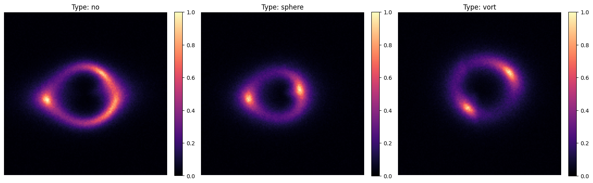
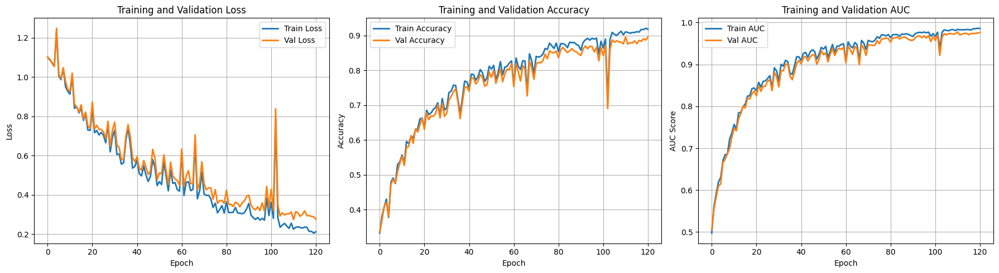
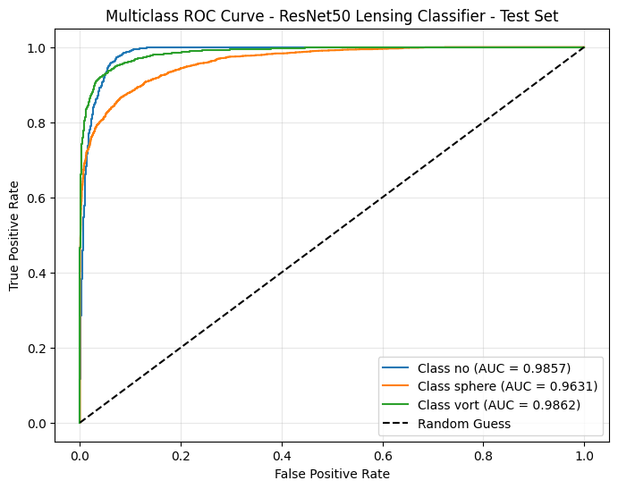
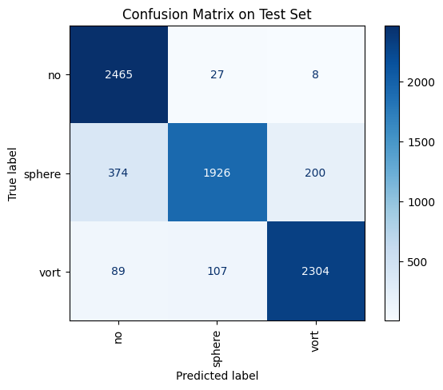

# Test 1 — Gravitational Lensing Classification with ResNet50

## Task Overview

This task involves multi-class classification of gravitational lensing images into three categories:

| Label | Description |
|-------|-------------|
| `no` | No dark matter substructure |
| `sphere` | Spherical (point-mass) substructure |
| `vort` | Vortex substructure |

Each image is a single-channel (grayscale) 150×150 NumPy array stored as a `.npy` file, simulating observations of strong gravitational lensing events with different underlying dark matter distributions.

---

## Model Architecture — ResNet50 (Transfer Learning)

A **ResNet50** pretrained on ImageNet is adapted for this task via transfer learning with the following modifications:

### Input Adaptation
The original `conv1` layer (designed for 3-channel RGB input) is replaced with a new `Conv2d(1, 64, kernel_size=7, stride=2, padding=3, bias=False)` to accept single-channel lensing images.

### Layer Freezing Strategy
To leverage pretrained low-level spatial features while adapting higher-level representations, a selective freezing strategy is used:

| Layer | Status |
|-------|--------|
| `conv1` (replaced) | Trainable |
| `layer1` | Frozen |
| `layer2` | Frozen |
| `layer3` | Trainable |
| `layer4` | Trainable |
| `fc` (replaced) | Trainable |

The early layers (`layer1`, `layer2`) capture generic edge and texture features that transfer well from ImageNet. The deeper layers (`layer3`, `layer4`) are fine-tuned to adapt to the astrophysical structure of lensing images.

### Classification Head
The original fully-connected layer is replaced with a custom head:

```
Linear(in_features → 256) → ReLU → Dropout(0.5) → Linear(256 → 3)
```

Dropout(0.5) is applied to regularise the head and reduce overfitting.

---

## Data Pipeline

### Custom Dataset
A custom `LensingNpyDataset` class handles loading `.npy` image arrays directly from a directory structure organised by class (`no/`, `sphere/`, `vort/`). It converts each array to a `float32` tensor and expands it to shape `(1, H, W)`.

### Train / Validation Split
The available training data is split 90/10 (random split) into a training set and a held-out validation set used for monitoring during training. The `val/` directory is reserved as a separate test set used only during final evaluation.

### Data Augmentation (Training Only)
To improve generalisation and account for the rotational and translational symmetry of lensing images, the following augmentations are applied during training:

| Augmentation | Parameters |
|---|---|
| `RandomRotation` | ±15° |
| `RandomAffine` | Translate up to 10% in each direction |
| `RandomHorizontalFlip` | p = 0.5 |
| `Normalize` | mean = 0.5, std = 0.5 |

At test/evaluation time, only normalisation is applied.

---

## Training Strategy

### Loss Function
`CrossEntropyLoss` — standard for multi-class classification with logit outputs.

### Optimizer
`Adam` with `weight_decay=1e-4` (L2 regularisation). **Differential learning rates** are applied per layer group to respect their differing levels of task-specificity:

| Layer Group | Learning Rate |
|---|---|
| `conv1` | 5 × 10⁻⁵ |
| `layer1`, `layer2` (frozen) | 5 × 10⁻⁶ |
| `layer3`, `layer4` | 5 × 10⁻⁵ |
| `fc` head | 5 × 10⁻⁴ |

The classification head receives the highest learning rate since its weights are randomly initialised, while frozen layers receive a very small rate to allow subtle adaptation without destroying pretrained features.

### Learning Rate Scheduling
`ReduceLROnPlateau` halves the learning rate (factor = 0.5) when validation loss fails to improve for 5 consecutive epochs, down to a minimum of 10⁻⁶. This allows aggressive learning early on and fine-grained tuning later.

### Gradient Clipping
Gradients are clipped to a maximum L2 norm of 1.0 per step to prevent exploding gradient instabilities.

### Early Stopping
Training is halted if the validation loss does not improve for **10 consecutive epochs**, preventing overfitting and unnecessary computation. The model trained for **120 epochs** before early stopping was triggered (out of a maximum of 150).

### Model Checkpointing
The model checkpoint with the lowest validation loss is saved to `model/best_model.pth` throughout training, ensuring the best generalising weights are always recoverable.

### Batch Size
32 samples per batch, loaded with `num_workers=4` and `pin_memory=True` for GPU-accelerated training.

---

## Results

### Training Curve Summary

The model was evaluated at epoch 0 (before any training) and after each of the 120 training epochs.

| Metric | Epoch 0 | Final (Ep. 120) | Best Val (Ep. 110) |
|---|---|---|---|
| Train Loss | 1.1015 | 0.2124 | — |
| Val Loss | 1.1017 | 0.2768 | **0.2749** |
| Train Accuracy | 33.30% | 91.78% | — |
| Val Accuracy | 33.60% | 89.50% | **89.57%** |
| Train AUC (macro OvR) | 0.4974 | 0.9856 | — |
| Val AUC (macro OvR) | 0.5052 | 0.9766 | **0.9774** |

### Image Classes



### Training Curves



### ROC Curves



### Confusion Matrix



### Key Observations

- **Convergence**: Loss and accuracy improved steadily across 120 epochs, with the learning rate scheduler reducing the rate at plateaus to allow fine-grained convergence.
- **Generalisation**: The small gap between training (91.78%) and validation (89.50%) accuracy indicates the model generalises well without severe overfitting. The dropout layer and weight decay in the head contribute to this.
- **AUC**: A macro One-vs-Rest AUC of **0.977** on the validation set demonstrates strong discriminative ability across all three lensing classes.
- **Early stopping**: Training halted at epoch 120 (best checkpoint at epoch 110), avoiding diminishing returns from further training.

### Evaluation on Test Set

The saved model weights are evaluated on the held-out `val/` test set in `evaluate_model.ipynb` using:

- **Confusion Matrix** — visualises per-class classification accuracy and typical misclassification patterns.
- **Per-class ROC Curves** — plots True Positive Rate vs False Positive Rate for each of the three classes using One-vs-Rest binarisation, with individual per-class AUC scores reported.

---

## File Structure

```
test1/
├── classify.ipynb                        # Training notebook
├── evaluate_model.ipynb                  # Evaluation notebook (test set)
├── dataset/
│   ├── train/                            # Training data (no/, sphere/, vort/)
│   └── val/                             # Test set (no/, sphere/, vort/)
├── model/
│   └── best_model.pth                   # Best checkpoint (lowest val loss)
└── DeepLense_Gravitational_Lensing_Results/
    ├── resnet50_lensing_final.pth        # Final model weights
    ├── class_mapping.json               # Class label → index mapping
    └── training_history.json            # Per-epoch loss, accuracy, AUC history
```

---

## Pretrained Model

The final trained model weights are stored in `DeepLense_Gravitational_Lensing_Results/resnet50_lensing_final.pth`. Because the file exceeds GitHub's size limit it is **not committed to the repository**. Download it from Google Drive:

**[resnet50_lensing_final.pth — Google Drive](https://drive.google.com/file/d/1DmlbkZsKYoJcdq3XFf7OrcbB9larAazF/view?usp=drive_link)**

Place the downloaded file at `test1/DeepLense_Gravitational_Lensing_Results/resnet50_lensing_final.pth` before running `evaluate_model.ipynb`.

---

## Dependencies

- Python 3.x
- PyTorch + torchvision
- NumPy
- scikit-learn
- matplotlib
- tqdm
- torchsummary
