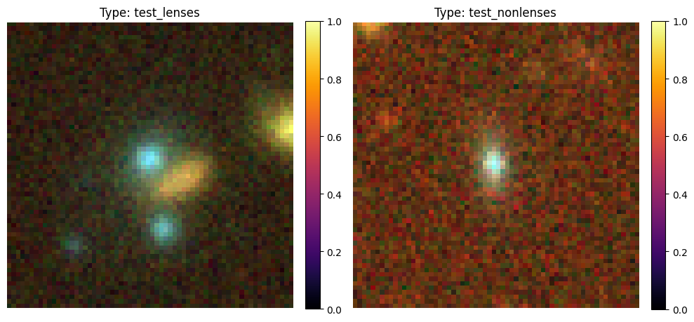
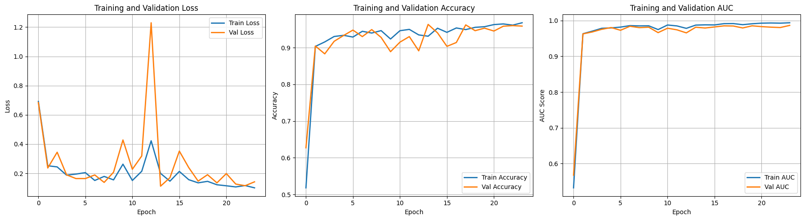
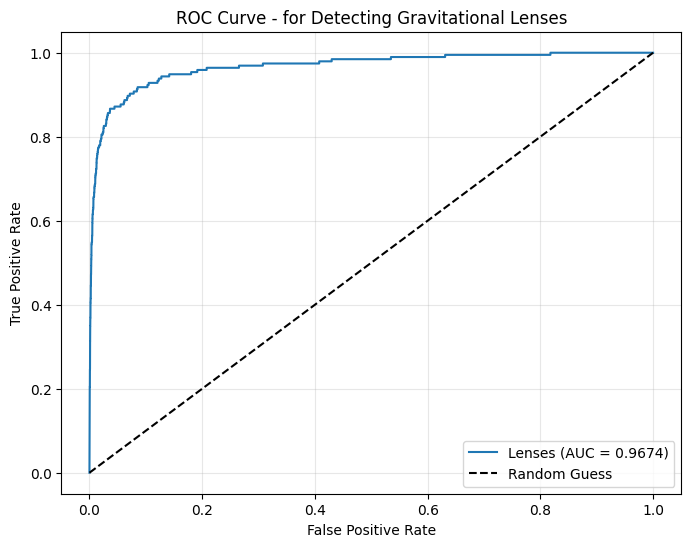
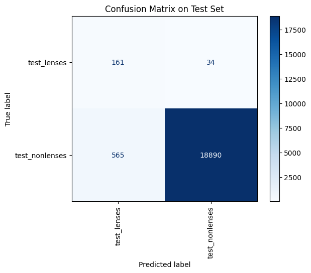

# Task 5 — Detecting Lensed Objects with a Physics-Informed Neural Network

## Overview

This directory contains a **Physics-Informed Neural Network (PINN)** adapted for the **binary classification** task of detecting gravitationally lensed objects. The model distinguishes between two classes:

| Label | Description |
|-------|-------------|
| `train_lenses` | Images containing gravitational lensing |
| `train_nonlenses` | Images without gravitational lensing |

The core approach re-uses the physics-informed architecture from [Test 7](../test7/) — embedding the gravitational lensing equation into the forward pass — but restructures it for a fundamentally different task: **binary detection** on a heavily imbalanced, 3-channel RGB dataset at 64 × 64 resolution, rather than the 3-class grayscale classification in Test 7.

---

## Strategy

### Physics-Informed Inductive Bias (shared with Test 7)

Rather than treating lensed-object detection as a pure black-box image classification problem, the model first transforms each image through a differentiable **Gravitational Lensing Layer**. This layer applies the reduced lensing equation to warp pixels from the *image plane* (what the telescope observes) to the *source plane* (the undistorted source), giving the downstream CNN backbone a physically motivated representation where lensing signatures are more salient.

### Handling Severe Class Imbalance

The training set is highly imbalanced: **1,730 lensed** images vs. **28,675 non-lensed** images (~1:16.6 ratio). Without mitigation the model would trivially predict the majority class. Two measures are applied:

1. **`WeightedRandomSampler`** — Per-sample weights inversely proportional to class frequency are used to construct each training batch. This ensures the model sees lensed and non-lensed examples in roughly equal proportion during each epoch, despite the underlying class imbalance.
2. **Aggressive data augmentation** — Random rotation (±180°), horizontal and vertical flips, and small affine translations are applied during training. These expand the effective size of the minority class and improve generalisation.

### Transfer Learning with Differential Learning Rates

The ResNet-50 backbone is initialised from **ImageNet pretrained weights** (unlike Test 7, which trains from scratch). Different learning rates are applied to each network component:

| Component | Learning Rate |
|-----------|--------------|
| Lensing layer (physics params) | 1 × 10⁻⁴ |
| Backbone conv1 | 5 × 10⁻⁵ |
| Backbone layer1–2 (frozen) | 5 × 10⁻⁶ |
| Backbone layer3–4 | 5 × 10⁻⁵ |
| Classification head | 5 × 10⁻⁴ |

This preserves useful pretrained features in early layers while allowing the deeper layers and physics parameters to adapt to the lensing domain.

---

## Model Architecture Modifications from Test 7

The PINN architecture in this task is derived from [`test7/PINN_model.py`](../test7/PINN_model.py) with key modifications to handle the different data characteristics and task. The changes are summarised below:

### 1. Input Channels: 1 → 3 (Grayscale → RGB)

Test 7 operates on **single-channel grayscale** images (150 × 150 × 1). Test 5 uses **3-channel RGB** images (64 × 64 × 3). This required changes in two places:

- **`GravitationalLensingLayer`**: `in_channels` changed from `1` to `3` — the deflection network's first `Conv2d` now accepts 3-channel input.
- **`PINNLensingClassifier`**: the backbone's `conv1` is replaced with `nn.Conv2d(3, 64, ...)` instead of `nn.Conv2d(1, 64, ...)`.

### 2. Image Size: 150 → 64

The `img_size` parameter is reduced from `150` to `64` to match the smaller spatial resolution of the Test 5 dataset. This affects the pre-computed θ-grid in the `GravitationalLensingLayer`, which defines the normalised $[-1,1]^2$ coordinate system used for the lensing equation.

### 3. Number of Classes: 3 → 2

Test 7 classifies images into 3 substructure types (`no`, `sphere`, `vort`). Test 5 performs **binary classification** (lensed vs. non-lensed). The final linear layer is changed from `Linear(256, 3)` to `Linear(256, 2)`.

### 4. Pretrained Backbone Weights

Test 7 initialises the ResNet-50 backbone with `weights=None` (random initialisation). Test 5 uses `weights=models.ResNet50_Weights.DEFAULT` (ImageNet pretrained). This is a deliberate choice: the RGB lensing images in Test 5 have richer visual features that benefit from ImageNet transfer learning, whereas the single-channel grayscale images in Test 7 are too domain-specific for pretrained RGB features to transfer effectively.

### 5. Data Loading: Shape Handling

The `LensingNpyDataset` in Test 7 assumes single-channel images and performs `squeeze(0)` followed by `unsqueeze(0)`. Test 5's dataset class handles a wider range of input shapes — 2D arrays are expanded to `(1, H, W)`, while 3D arrays with channels-last layout are transposed to `(C, H, W)` — to accommodate the RGB `.npy` files.

### Summary of Key Differences

| Aspect | Test 7 | Test 5 |
|--------|--------|--------|
| **Task** | 3-class substructure classification | Binary lensed-object detection |
| **Input** | 1 × 150 × 150 (grayscale) | 3 × 64 × 64 (RGB) |
| **Output classes** | 3 (`no`, `sphere`, `vort`) | 2 (`lenses`, `nonlenses`) |
| **Backbone init** | Random (`weights=None`) | ImageNet pretrained |
| **Class balance** | Balanced (2,500 per class) | Imbalanced (1:16.6 ratio) |
| **Imbalance handling** | None needed | `WeightedRandomSampler` |
| **Augmentation** | ±15° rotation, 10% translate, h-flip | ±180° rotation, h-flip, v-flip, 5% translate |

---

## Results

### Training History (24 epochs, early stopping at epoch 23)

| Metric | Train | Validation |
|--------|-------|------------|
| Loss | 0.1010 | **0.1153** |
| Accuracy | 96.76% | **96.32%** |
| AUC | 0.9935 | **0.9862** |

**Learned Einstein radius** after training: **θ_E ≈ 0.2920** (normalised $[-1,1]$ units)

The model converged quickly, reaching >90% validation accuracy by epoch 2 and stabilising above 95% by epoch 5. The small gap between train and validation AUC (0.9935 vs. 0.9862) indicates the physics layer and dropout regularisation effectively prevent overfitting despite the class imbalance.

### Image Classes



### Training Curves



### ROC Curve



### Confusion Matrix



### Key Observations

- **Rapid convergence** — The combination of ImageNet pretraining and the physics-informed lensing layer allowed the model to converge in just 24 epochs (compared to 138 in Test 7), as the backbone already possesses strong low-level feature extractors and the lensing layer provides a physically meaningful image transformation.
- **Effective imbalance handling** — Despite the 1:16.6 class ratio, the `WeightedRandomSampler` ensured the model learned meaningful features for the minority lensed class, achieving a validation AUC of >0.9862.
- **Stable Einstein radius** — The learned θ_E (0.2920) remained close to its initialisation (0.30), suggesting the analytical SIS model already provides a reasonable approximation for this dataset, with the learned residual corrections handling image-specific deviations.

---

## File Structure

```
test5/
├── PINN_model.py                 # Model architecture (adapted from test7)
├── Datect_lensed_objects.ipynb   # Main training notebook
├── evaluate_model.ipynb          # Standalone evaluation notebook
├── dataset/                      # (gitignored — not committed)
│   ├── train/
│   │   ├── train_lenses/         # 1,730 lensed images (.npy)
│   │   └── train_nonlenses/      # 28,675 non-lensed images (.npy)
│   └── test/
│       ├── test_lenses/          # 195 lensed images (.npy)
│       └── test_nonlenses/       # 19,455 non-lensed images (.npy)
├── model/
│   └── best_model.pth            # Best checkpoint (gitignored)
├── Results/
│   ├── pinn_lensing_final.pth    # Final saved model weights
│   ├── class_mapping.json        # Class → index mapping
│   └── training_history.json     # Per-epoch loss / accuracy / AUC
└── README.md                     # This file
```

---

## Pretrained Model

The final trained model weights are stored in `Results/pinn_lensing_final.pth`. Because the file exceeds GitHub's size limit it is **not committed to the repository**. Download it from Google Drive:

**[pinn_lensing_final.pth — Google Drive](https://drive.google.com/file/d/1HguccXxK7vKp9JQVPAWcq-JYhiuhkziK/view?usp=drive_link)**

Place the downloaded file at `test5/Results/pinn_lensing_final.pth` before running `evaluate_model.ipynb`.

---

## Reproducing the Results

### Training

Open and run all cells in `Datect_lensed_objects.ipynb`. The notebook:
1. Loads and visualises one sample per class.
2. Applies `WeightedRandomSampler` to handle class imbalance.
3. Builds the PINN model with ImageNet pretrained backbone.
4. Trains for up to 150 epochs with early stopping (patience = 10).
5. Plots training curves (loss, accuracy, AUC) and ROC curves.
6. Saves the final model and training history to `Results/`.

### Evaluation Only

Open `evaluate_model.ipynb` — it imports `PINNLensingClassifier` from `PINN_model.py`, loads `Results/pinn_lensing_final.pth`, and produces:
- Confusion matrix on the test set
- Per-class ROC curves with AUC scores

---

## Dependencies

```
torch
torchvision
numpy
matplotlib
scikit-learn
torchsummary
tqdm
pandas
```
