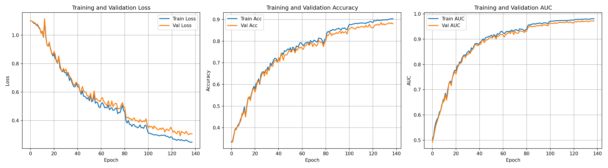
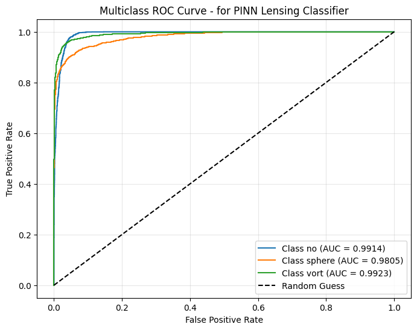
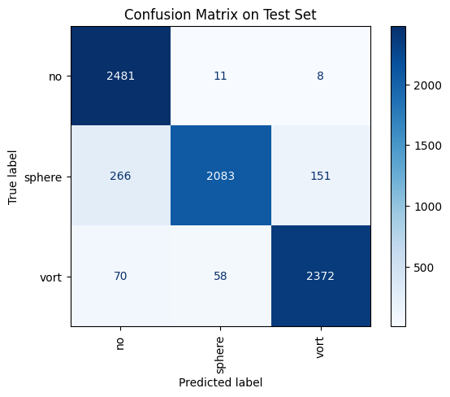

# Task 7 — Physics-Informed Neural Network for Gravitational Lensing Classification

## Overview

This directory contains a **Physics-Informed Neural Network (PINN)** that classifies simulated strong gravitational lensing images into three categories:

| Label | Description |
|-------|-------------|
| `no` | No substructure |
| `sphere` | Subhalo (spherical dark matter clump) |
| `vort` | Vortex substructure |

The core idea is to embed the **gravitational lensing physics** directly into the forward pass of the neural network, rather than treating lensing classification purely as a black-box image recognition problem. This gives the model a physically motivated inductive bias that makes learning easier and the learned parameters more interpretable.

---

## Strategy

### Physics-Informed Inductive Bias

Standard CNNs learn to distinguish lensing classes purely from pixel statistics. A PINN instead first transforms the image using the known physics of gravitational lensing, then passes the transformed image to the CNN backbone. This means:

1. The model is forced to reason in the *source plane* (what the galaxy actually looks like) rather than the *image plane* (what the telescope observes after lensing distortion).
2. The Einstein radius — a key physical parameter — becomes a **learnable scalar** that the network tunes during training.
3. Data-driven residual corrections handle substructure effects that deviate from the idealised analytical model.

---

## Model Architecture

The model architecture is defined in [`PINN_model.py`](PINN_model.py) and consists of two components.

### 1. `GravitationalLensingLayer`

This differentiable layer implements the reduced lensing equation:

$$\beta = \theta - \alpha(\theta)$$

where:
- $\theta$ is the observed image-plane position (normalised to $[-1, 1]^2$)
- $\beta$ is the inferred source-plane position
- $\alpha(\theta) = \alpha_{\text{SIS}} + \alpha_{\text{NN}}$ is the total deflection angle

**Analytical SIS component** — Singular Isothermal Sphere deflection:

$$\alpha_{\text{SIS}}(\theta) = \theta_E \cdot \frac{\theta}{|\theta|}$$

$\theta_E$ is the Einstein radius, stored in log-space as a learnable `nn.Parameter` to keep it strictly positive.

**Learned residual** — a lightweight 3-layer CNN (`deflection_net`) predicts a per-pixel correction $\alpha_{\text{NN}}$, scaled to ≤ 10 % of the SIS deflection. This lets the model account for subhalo-induced perturbations that deviate from the smooth SIS profile.

The source-plane image is reconstructed from $\beta$ using **differentiable bilinear grid sampling** (`F.grid_sample`), so gradients flow back through the physics into the backbone.

### 2. `PINNLensingClassifier`

```
Input (B × 1 × 150 × 150)
  └─► GravitationalLensingLayer    ← physics warp
  └─► ResNet-50 backbone           ← feature extraction
        conv1:  1-channel grayscale input
        layer1, layer2: frozen (pretrained weights preserved)
        layer3, layer4: fine-tuned
        fc: replaced with Identity()
  └─► Classification head
        Linear(2048 → 256) → ReLU → Dropout(0.5) → Linear(256 → 3)
  └─► Class logits (3)
```

**Key design choices:**
- The first conv layer of ResNet-50 is replaced with a single-channel variant to match the grayscale lensing images (150 × 150 px).
- Early layers (layer1, layer2) are frozen to preserve ImageNet pretrained features.
- Deeper layers (layer3, layer4) are fine-tuned at a moderate learning rate.

---

## Training Setup

### Data

- **Source:** `.npy` files organised by class under `dataset/train/{no,sphere,vort}/`
- **Split:** 90 % training / 10 % validation (random split from training folder)
- **Test set:** `dataset/val/` (held-out, used only for final evaluation)

> `dataset/` is excluded from the repository via `.gitignore`.

### Augmentation

Applied only during training:

| Transform | Value |
|-----------|-------|
| Random rotation | ±15° |
| Random affine translate | ±10 % |
| Random horizontal flip | p = 0.5 |
| Normalisation | mean = 0.5, std = 0.5 |

No spatial augmentation is applied during evaluation (normalisation only).

### Optimiser & Scheduling

**Adam** with **differential learning rates** across network components:

| Component | Learning rate |
|-----------|--------------|
| Lensing layer (physics params) | 1 × 10⁻⁴ |
| backbone conv1 | 5 × 10⁻⁵ |
| backbone layer1–2 (frozen) | 5 × 10⁻⁶ |
| backbone layer3–4 | 5 × 10⁻⁵ |
| Classification head | 5 × 10⁻⁴ |

- **Weight decay:** 1 × 10⁻⁴
- **Loss function:** Cross-entropy
- **Scheduler:** `ReduceLROnPlateau` — halves the LR if validation loss does not improve for 5 consecutive epochs
- **Early stopping:** Training halts after 10 epochs without improvement in validation loss
- **Checkpointing:** Best model saved to `model/best_model.pth` (excluded from repo)

### Training budget

Up to 150 epochs; early stopping triggered at epoch **138**.

---

## Results

### Validation Split (best checkpoint, epoch 128)

| Metric | Train | Validation |
|--------|-------|------------|
| Loss | 0.2608 | **0.2930** |
| Accuracy | 0.8968 | **0.8860** |
| AUC (macro OvR) | 0.9792 | **0.9733** |

**Learned Einstein radius** after training: **θ_E ≈ 0.2774** (normalised $[-1,1]$ units)

### Image Classes


### Training Curves



### ROC Curves



### Confusion Matrix



The model converged smoothly with no significant overfitting gap between training and validation AUC, indicating that the physics layer acts as an effective regulariser on top of the standard dropout and weight-decay regularisation.

---

### Test Set Evaluation — PINN vs. ResNet50 (Test 1)

Both models are evaluated on the **held-out test set** (`dataset/val/`, 2500 samples per class = 7500 total). Results are taken from `evaluate_pinn.ipynb` and `test1/evaluate_model.ipynb` respectively.

#### Confusion Matrix Comparison

**Test 1 — ResNet50 (plain fine-tuning):**

|  | Predicted: no | Predicted: sphere | Predicted: vort |
|---|---|---|---|
| **True: no** | 2465 | 27 | 8 |
| **True: sphere** | 374 | 1926 | 200 |
| **True: vort** | 89 | 107 | 2304 |

**Test 7 — PINN (this model):**

|  | Predicted: no | Predicted: sphere | Predicted: vort |
|---|---|---|---|
| **True: no** | 2481 | 11 | 8 |
| **True: sphere** | 266 | 2083 | 151 |
| **True: vort** | 70 | 58 | 2372 |

**Per-class recall on the test set:**

| Class | ResNet50 | PINN | Improvement |
|-------|----------|------|-------------|
| `no` | 98.60% | 99.24% | +0.64 pp |
| `sphere` | 77.04% | 83.32% | **+6.28 pp** |
| `vort` | 92.16% | 94.88% | +2.72 pp |
| **Overall accuracy** | **89.27%** | **92.48%** | **+3.21 pp** |

The largest gain is on the `sphere` class. Spherical subhalo substructure causes *subtle*, localised perturbations to the lensing pattern — much less visually distinctive than the extended vortex arcs. The plain ResNet50 misclassifies 374 sphere images as `no` (no substructure), because without a physics prior it conflates the smooth SIS background with a lightly perturbed sphere lens. The PINN's gravitational lensing layer first undoes the bulk SIS deflection, exposing the residual perturbations in the source plane; the CNN then operates on a representation where subhalo signatures are more salient. This reduces sphere→no misclassifications from **374 to 266** (−29%).

Off-diagonal cross-class confusion (sphere↔vort) also drops substantially: 200→151 (sphere predicted as vort) and 107→58 (vort predicted as sphere), reflecting cleaner class boundaries after source-plane reconstruction.

#### ROC Curve Comparison

**Per-class AUC (One-vs-Rest) on the test set:**

| Class | ResNet50 | PINN | Improvement |
|-------|----------|------|-------------|
| `no` | 0.9857 | 0.9914 | +0.0057 |
| `sphere` | 0.9631 | 0.9805 | **+0.0174** |
| `vort` | 0.9862 | 0.9923 | +0.0061 |
| **Macro average** | **0.9783** | **0.9881** | **+0.0098** |

The ROC curves confirm the confusion matrix story. All three PINN curves hug the top-left corner more tightly than their ResNet50 counterparts, but the improvement is most dramatic for `sphere` (+0.0174 AUC). At very low false-positive rates — the operating regime that matters most for rare-event astrophysical searches — the PINN's sphere curve shows a much steeper initial rise, meaning it recovers a larger fraction of true sphere lenses before admitting any false positives. Both `no` and `vort` were already well-separated in Test 1; the PINN pushes them further toward near-perfect discrimination (AUC > 0.99).

#### Summary

The physics-informed inductive bias provides the most benefit precisely where it is most needed: distinguishing lenses with weak substructure signatures (`sphere`) from structureless lenses. By operating in the source plane rather than the image plane, the model achieves a **+3.2 percentage point** gain in overall test accuracy and a **+0.010 gain** in macro AUC, entirely driven by improved `sphere` classification.

---

## File Structure

```
test7/
├── PINN_model.py                # Model architecture (GravitationalLensingLayer + PINNLensingClassifier + LensingNpyDataset)
├── classify_pinn.ipynb          # Main training notebook
├── evaluate_pinn.ipynb          # Standalone evaluation notebook
├── dataset/                     # (gitignored — not committed)
│   ├── train/{no,sphere,vort}/  # Training data (.npy files)
│   └── val/{no,sphere,vort}/    # Test/evaluation data
├── model/                       # (gitignored — not committed)
│   └── best_model.pth           # Best checkpoint saved during training
├── DeepLense_PINN_Results/
│   ├── pinn_lensing_final.pth   # Final saved model with best weights
│   ├── class_mapping.json       # Class → index mapping
│   ├── training_curves_pinn.png # Training/validation loss, accuracy, and AUC plots
│   └── training_history.json    # Per-epoch loss / accuracy / AUC
└── README.md                    # This file
```

---

## Pretrained Model

The final trained model weights are stored in `DeepLense_PINN_Results/pinn_lensing_final.pth`. Because the file exceeds GitHub's size limit it is **not committed to the repository**. Download it from Google Drive:

**[pinn_lensing_final.pth — Google Drive](https://drive.google.com/file/d/1swvx4bzEEMCsOaR5D55bHlS_W94fgZj-/view?usp=drive_link)**

Place the downloaded file at `test7/DeepLense_PINN_Results/pinn_lensing_final.pth` before running `evaluate_pinn.ipynb`.

---

## Reproducing the Results

### Training

Open and run all cells in `classify_pinn.ipynb`. The notebook:
1. Loads and visualises one sample per class.
2. Builds the PINN model and prints parameter counts.
3. Trains for up to 150 epochs with early stopping.
4. Plots training curves and multiclass ROC curves.
5. Saves the final model and training history to `DeepLense_PINN_Results/`.

### Evaluation only

Open `evaluate_pinn.ipynb` — it imports `PINNLensingClassifier` from `PINN_model.py` and loads `DeepLense_PINN_Results/pinn_lensing_final.pth` (no training needed) and produces:
- Confusion matrix on the test set
- Per-class ROC curves with AUC scores

---

## Dependencies

```
torch
torchvision
numpy
matplotlib
scikit-learn
torchsummary
tqdm
```
